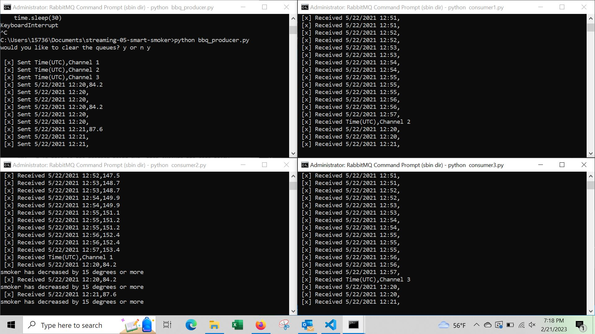

# streaming-06-smart-smoker
Building consumers

author: missy bernskoetter
date: 2/16/2023

This is the build of the three consumers that will communicate with the producer from module 5. 
Used the code from module 4, making a new file for each consumer. 
Each consumer will have the same base code, with changes based on which consumer will read each queue's data.

consumer2= smoker temps
consumer1= food A temps
consumer3= food B temps

Each consumer should have times associated, which was a part of what was built with the producer. 
If these don't show, may have to adjust code within the producer file. 

The primary accomplishment is to see if there are changes in the temperatures over time. 

You will need to reference the producer while building this code to make sure they communicate correctly.

Everything is running correctly at this point, with the smoker having several points where the temp decreased by 15 degrees or more.

